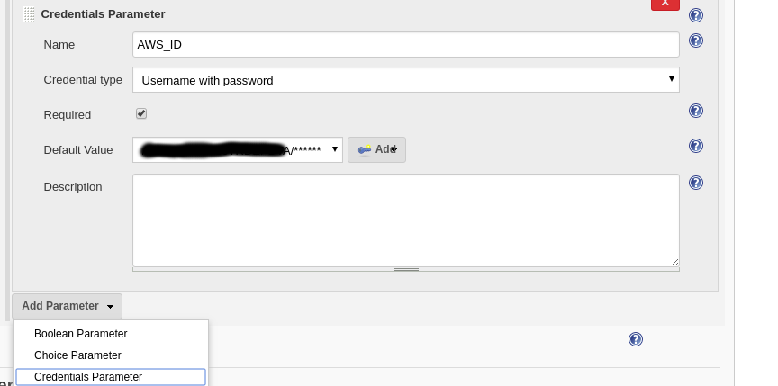
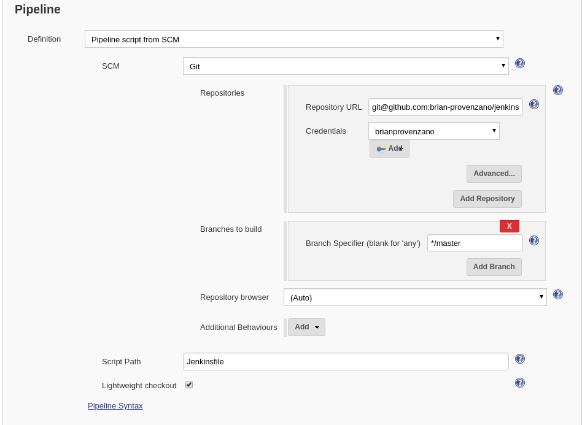
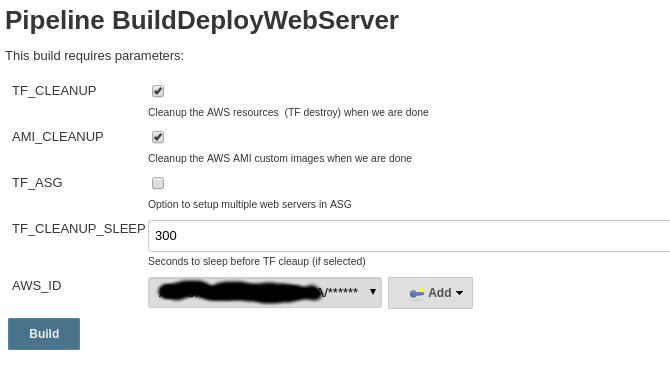

# Test Pipeline

## Jenkins Declarative Pipeline Example (with packer, terraform, aws, ansible)

NOTE: This can be used with my custom Jenkins containers : [jenkins docker alpine](https://github.com/brian-provenzano/jenkins-alpine-container) and [jenkins docker debian](https://github.com/brian-provenzano/jenkins-container)

### Details
Contains simple Jenkins pipeline that does the following:
- Create a custom AWS AMI using Packer; Ansible provisioner to config the image as simple apache static site
- Terraform creates the infra on AWS (choose either single webserver OR ASG/ELG setup)
- Options to tear down TF infra and Packer AMI when done to avoid charges and stay in the good blessings of the AWS free tier

### Setup
To get started do the following (this isn't step by step so it assumes some very basic Jenkins knowledge):

1. Create a new declarative pipeline in jenkins
2. Clone the repo https://github.com/brian-provenzano/jenkins-pipeline-immut locally on your dev env, create your own repo in github, git init, add, commit, push origin to your repo to get setup.  Setup your access using keys as needed.
2. Add Credentials parameter that contains your AWS access and secret keys.  Use the "usernamne/password" option.

3. Setup the job to pull the repo for the Jenkinsfile (pipeline).  Add your keys as needed (from Step 2)

4.  You should end up with something that looks like this when you view the job (after the initial run/pull).

#### Pipeline Job parameters / options:
- Cleanup TF infra when done (boolean) * 
- Cleanup custom AMI when done (boolean) *
- Use jenkins credentials store for AWS credentials
- Deploy as ASG/ELB or simple web server instance; default is false for simple web instance (boolean)
- How long to sleep job after TF creates infra so we can test/view what was done. *

NOTE: *These steps mainly there since this is a lab/test to make sure costs are low and/or stay in free tier.

### TODO
- packer build AMI in AWS with code baked (build etc); currently only configures a static instance of Apache
- seperate out the terraform, ansible, packer Iaac/config into seperate repos and pull those directly as part of pipeline instead of packing into one repo.  Currently setup this way for easy startup / testing...
- extend ansible configs to install real systems, maybe use RDS (via TF) etc.

